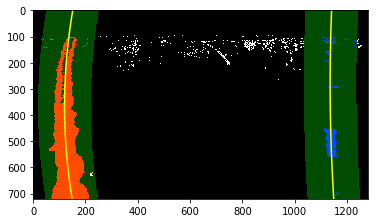
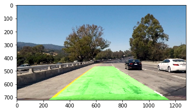

[//]: # (Image References)

[image1]: ./examples/undistort_output.png "Undistorted"
[image2]: ./test_images/test1.jpg "Road Transformed"
[image3]: ./examples/binary_combo_example.jpg "Binary Example"
[image4]: ./examples/warped_straight_lines.jpg "Warp Example"
[image5]: ./examples/color_fit_lines.jpg "Fit Visual"
[image6]: ./examples/example_output.jpg "Output"
[video1]: ./project_video.mp4 "Video"


### Camera Calibration

#### 1. Briefly state how you computed the camera matrix and distortion coefficients. Provide an example of a distortion corrected calibration image.
The camera matrix and distortion coefficient play a great role in removing distortion from images. To compute these, I used a set of chess board images. Used the images to find corners in chessboard and compute object points(3D) w.r.t. image points(2D).
I start by preparing "object points", which will be the (x, y, z) coordinates of the chessboard corners in the world. Here I am assuming the chessboard is fixed on the (x, y) plane at z=0, such that the object points are the same for each calibration image.  Thus, `objp` is just a replicated array of coordinates, and `objpoints` will be appended with a copy of it every time I successfully detect all chessboard corners in a test image.  `imgpoints` will be appended with the (x, y) pixel position of each of the corners in the image plane with each successful chessboard detection.  

Computed the Camera Matrix & Distortion coeff by passing the object points, image points and other parameters to OpenCV's calibrateCamera() method. This calibrateCamera() function helps to calibrate the camera. 

The Cam Matrix & Dist coeff helped to undistort the images. 


### Pipeline (single images)

#### 1. Provide an example of a distortion-corrected image.

I used the object points and image points and calibrated camera matrices to undistort the images. I coded a function for performing this task:
```
def cal_undistort(img, objpoints, imgpoints):
    # Use cv2.calibrateCamera() and cv2.undistort()
    ret, mtx, dist, rvecs, tvecs = cv2.calibrateCamera(objpoints, imgpoints, img.shape[:2], None, None)
    undist = cv2.undistort(img, mtx, dist, None, mtx)
    return undist
```
The above function returns numpy array of undistorted image.


#### 2. Describe how you used color transforms, gradients or other methods to create a thresholded binary image.  Provide an example of a binary image result.

I tried numerous combinations of color conversions but I got good results only with RGB to HLS conversion. It detected the yellow lane lines perfectly. 


I used a combination of color and gradient thresholds to generate a binary image. Coded a pipeline() function for this task.  It returns 2 different binary image results(color and combined binary). I am interested only in combined binary image. 


#### 3. Describe how (and identify where in your code) you performed a perspective transform and provide an example of a transformed image.

The perspective transform was done to get a bird eye view of road. This helps to compute curvature and understand the lane lines direction.
I assumed that the camera is placed at the center. 
For performing perspective transform, I was expected to set source and destination points. 
```
src = np.float32([[342, 645],
                  [1024, 638],
                  [748, 475],
                  [574, 475]
                  ])
offset = 135
dst = np.float32([[offset, offset],
                  [img_size[0]-offset, offset],
                  [img_size[0]-offset, img_size[1]-offset],
                  [offset, img_size[1]-offset]
                 ])
```
Used getPerspectiveTransform() to calculate a perspective transform from four pairs of the corresponding points.
Then warped the image to correct position using its perspective transform.


#### 4. Describe how (and identify where in your code) you identified lane-line pixels and fit their positions with a polynomial?

I used a histogram and polynomial for finding the lane lines in transformed image. The 2nd order polynomial helped to fit my lane lines like this:




#### 5. Describe how (and identify where in your code) you calculated the radius of curvature of the lane and the position of the vehicle with respect to center.

I have code a processing() function to perform all these tasks. I used formula to compute the curvature of road:
```
left_curverad = ((1 + (2*left_fit_cr[0]*y_eval*ym_per_pix + left_fit_cr[1])**2)**1.5) / np.absolute(2*left_fit_cr[0])
right_curverad = ((1 + (2*right_fit_cr[0]*y_eval*ym_per_pix + right_fit_cr[1])**2)**1.5) / np.absolute(2*right_fit_cr[0])
```
It includes a lot of polynomial computations. I have

#### 6. Provide an example image of your result plotted back down onto the road such that the lane area is identified clearly.

I implemented these steps in notebook cells and processing() function is supposed to perform almost everything related to threasholding and other polynomial computations. By performing all the steps, I am able to get this kind of results:
 

---

### Pipeline (video)

#### 1. Provide a link to your final video output.  Your pipeline should perform reasonably well on the entire project video (wobbly lines are ok but no catastrophic failures that would cause the car to drive off the road!).

Here's a [link to my video result](./abc.mp4)

---

### Discussion

#### 1. Briefly discuss any problems / issues you faced in your implementation of this project.  Where will your pipeline likely fail?  What could you do to make it more robust?

 It was quite tough to implement polynomial computations and curvature part. I feel I am able to get reasonable results, but they can still be enhanced. :-) 